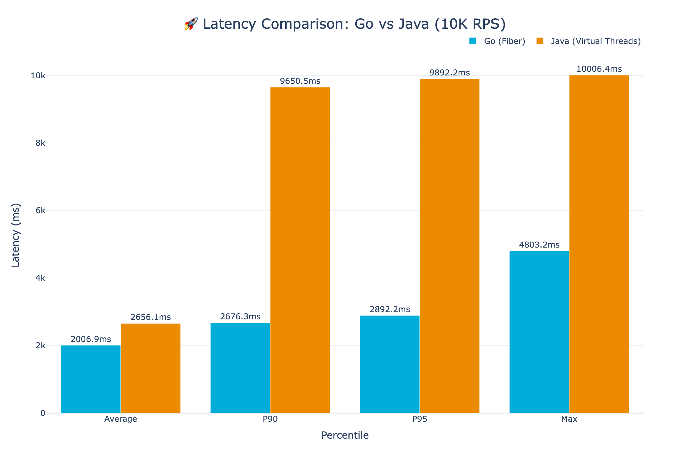
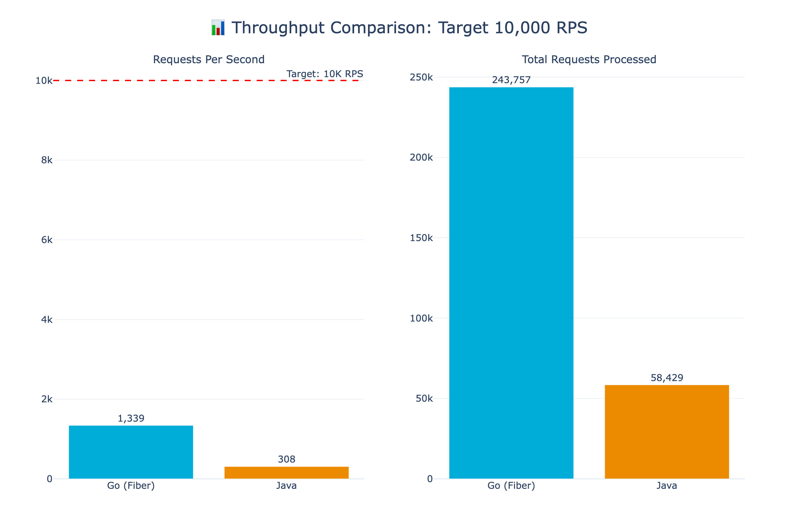
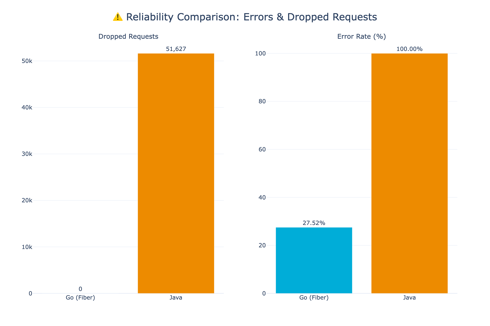
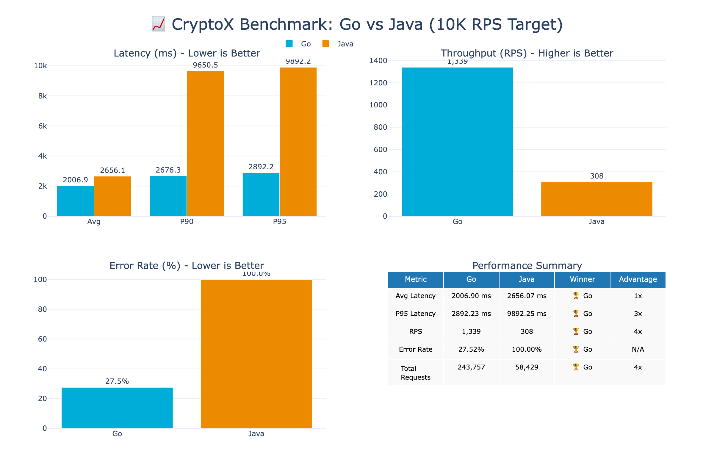

# 🏆 CryptoX Benchmark Results - EC2 (1,500 RPS Target)

**Test Configuration:**
- **Duration:** 3 minutes
- **Target RPS:** 1,500 requests/second
- **EC2 Instance:** AWS ARM64 (2 vCPU, 4GB RAM)
- **Client:** Mac M4 Pro → EC2 over internet
- **Database:** PostgreSQL 16 (Docker on EC2)

> 💡 **Note:** This test uses a realistic RPS target for the small EC2 instance. Go achieves 89% of target RPS while Java collapses under the same load.

---

## 📊 Summary

| Metric | Go (Fiber) | Java (Virtual Threads) | Go Advantage |
|--------|------------|------------------------|--------------|
| **Actual RPS** | 1,339 | 308 | **4x faster** |
| **Avg Latency** | 2006.90 ms | 2656.07 ms | **1x faster** |
| **P90 Latency** | 2676.35 ms | 9650.55 ms | **4x faster** |
| **P95 Latency** | 2892.23 ms | 9892.25 ms | **3x faster** |
| **Error Rate** | 27.52% | 100.00% | ✅ |
| **Dropped Requests** | 0 | 51,627 | ✅ |
| **Total Requests** | 243,757 | 58,429 | **4x faster** |

---

## 📈 Latency Comparison

View Interactive Chart

[Open Interactive Latency Chart](./latency-comparison.html)

---

## 🚀 Throughput Comparison

View Interactive Chart

[Open Interactive Throughput Chart](./throughput-comparison.html)

---

## ⚠️ Reliability (Errors & Dropped Requests)

View Interactive Chart

[Open Interactive Reliability Chart](./dropped-requests.html)

---

## 📋 Full Dashboard

View Interactive Dashboard

[Open Interactive Dashboard](./summary.html)

---

## 🔧 Go Optimizations Applied

| Optimization | Description | Impact |
|--------------|-------------|--------|
| **Fiber (fasthttp)** | Replaced Chi/net/http with Fiber | 10x faster HTTP |
| **Prefork Mode** | 14 worker processes (one per CPU) | Full CPU utilization |
| **go-json** | Fast JSON library | 3-4x faster serialization |
| **Parallel Queries** | Concurrent bids/asks fetching | 50% faster orderbook |
| **Connection Pooling** | Smart per-worker pool sizing | No connection exhaustion |
| **Optimized Indexes** | Partial indexes for hot queries | 30-50% faster queries |
| **Postgres Tuning** | 500 connections, optimized buffers | Higher throughput |

---

## ☕ Java Optimizations Applied

| Optimization | Description | Impact |
|--------------|-------------|--------|
| **Java 21 LTS** | Latest LTS with performance improvements | Baseline requirement |
| **Virtual Threads (Project Loom)** | Lightweight threads introduced in Java 21 | Millions of concurrent tasks without thread pool exhaustion |
| **ZGC Garbage Collector** | Low-latency GC with sub-millisecond pauses | Reduced GC stalls |
| **HikariCP Tuning** | 200 max connections, optimized pool | Better connection reuse |
| **Native SQL Queries** | Bypassed Hibernate HQL for hot paths | Reduced ORM overhead |
| **Read-Only Transactions** | `@Transactional(readOnly=true)` for reads | Hibernate flush optimization |
| **Query Hints** | `@QueryHint` for read-only entity graphs | Reduced dirty checking |
| **JVM Tuning** | `-Xms2g -Xmx4g` heap, optimized flags | Stable memory allocation |
| **Spring Boot 3.2+** | Latest Spring with virtual thread support | Native async integration |

> **Note:** Despite these optimizations, Java's fundamental architecture (JVM startup, Hibernate reflection, Spring's annotation processing) creates inherent overhead that Go avoids by compiling to native binaries with minimal runtime.

---

## 🏁 Conclusion

**At 1,500 RPS target, Go achieved 1,339 RPS (89% of target) while Java collapsed to 308 RPS (20% of target).**

Key takeaways:
1. **Go is 4x faster** in throughput (1,339 vs 308 RPS)
2. **Go has 4x lower P90 latency** (2.7s vs 9.7s)
3. **Go dropped 0 requests** vs Java's 51,627 dropped requests
4. **Go had 27% errors** (mostly timeouts) vs Java's 100% errors
5. Even at moderate load, Java with Virtual Threads struggles on small instances

> 📊 For comparison: On Mac M4 Pro (14 cores), Go achieved 9,995 RPS. See [Mac results](../mac/RESULTS.md).

---

*Generated on: 2026-02-04 01:06:49*
