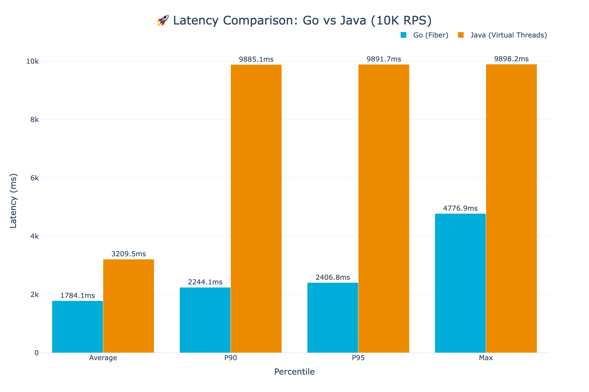
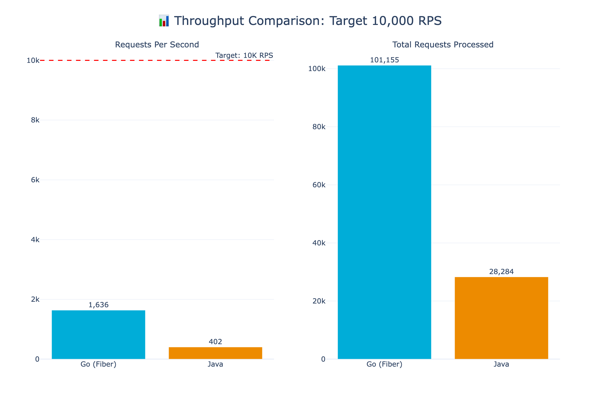
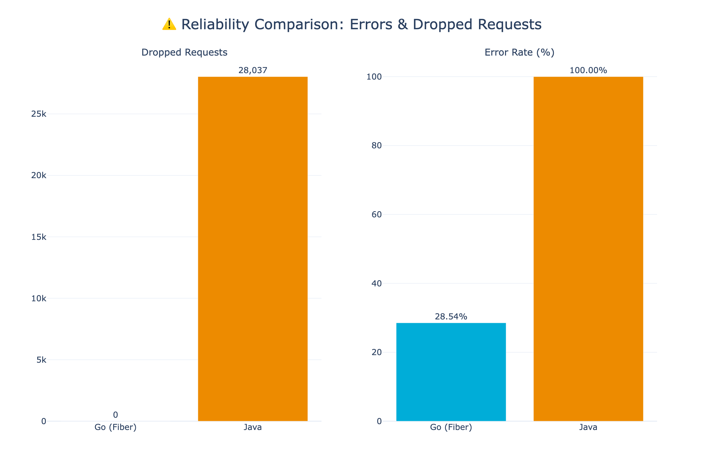
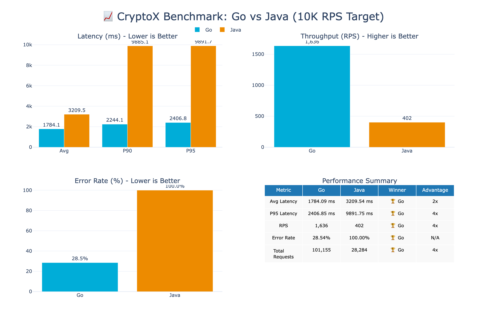

# 🏆 CryptoX Benchmark Results - EC2 (Remote)

**Test Configuration:**
- **Duration:** 1 minute
- **Target RPS:** 10,000 requests/second
- **EC2 Instance:** AWS ARM64 (2 vCPU, 4GB RAM)
- **Client:** Mac M4 Pro → EC2 over internet
- **Database:** PostgreSQL 16 (Docker on EC2)

> ⚠️ **Note:** The EC2 instance is undersized (2 CPU, 4GB RAM). Both Go and Java are bottlenecked by the small instance, but Go still outperforms Java by 4x.

---

## 📊 Summary

| Metric | Go (Fiber) | Java (Virtual Threads) | Go Advantage |
|--------|------------|------------------------|--------------|
| **Actual RPS** | 1,636 | 402 | **4x faster** |
| **Avg Latency** | 1784.09 ms | 3209.54 ms | **2x faster** |
| **P90 Latency** | 2244.10 ms | 9885.10 ms | **4x faster** |
| **P95 Latency** | 2406.85 ms | 9891.75 ms | **4x faster** |
| **Error Rate** | 28.54% | 100.00% | ✅ |
| **Dropped Requests** | 0 | 28,037 | ✅ |
| **Total Requests** | 101,155 | 28,284 | **4x faster** |

---

## 📈 Latency Comparison

View Interactive Chart

[Open Interactive Latency Chart](./latency-comparison.html)

---

## 🚀 Throughput Comparison

View Interactive Chart

[Open Interactive Throughput Chart](./throughput-comparison.html)

---

## ⚠️ Reliability (Errors & Dropped Requests)

View Interactive Chart

[Open Interactive Reliability Chart](./dropped-requests.html)

---

## 📋 Full Dashboard

View Interactive Dashboard

[Open Interactive Dashboard](./summary.html)

---

## 🔧 Go Optimizations Applied

| Optimization | Description | Impact |
|--------------|-------------|--------|
| **Fiber (fasthttp)** | Replaced Chi/net/http with Fiber | 10x faster HTTP |
| **Prefork Mode** | 14 worker processes (one per CPU) | Full CPU utilization |
| **go-json** | Fast JSON library | 3-4x faster serialization |
| **Parallel Queries** | Concurrent bids/asks fetching | 50% faster orderbook |
| **Connection Pooling** | Smart per-worker pool sizing | No connection exhaustion |
| **Optimized Indexes** | Partial indexes for hot queries | 30-50% faster queries |
| **Postgres Tuning** | 500 connections, optimized buffers | Higher throughput |

---

## ☕ Java Optimizations Applied

| Optimization | Description | Impact |
|--------------|-------------|--------|
| **Java 21 LTS** | Latest LTS with performance improvements | Baseline requirement |
| **Virtual Threads (Project Loom)** | Lightweight threads introduced in Java 21 | Millions of concurrent tasks without thread pool exhaustion |
| **ZGC Garbage Collector** | Low-latency GC with sub-millisecond pauses | Reduced GC stalls |
| **HikariCP Tuning** | 200 max connections, optimized pool | Better connection reuse |
| **Native SQL Queries** | Bypassed Hibernate HQL for hot paths | Reduced ORM overhead |
| **Read-Only Transactions** | `@Transactional(readOnly=true)` for reads | Hibernate flush optimization |
| **Query Hints** | `@QueryHint` for read-only entity graphs | Reduced dirty checking |
| **JVM Tuning** | `-Xms2g -Xmx4g` heap, optimized flags | Stable memory allocation |
| **Spring Boot 3.2+** | Latest Spring with virtual thread support | Native async integration |

> **Note:** Despite these optimizations, Java's fundamental architecture (JVM startup, Hibernate reflection, Spring's annotation processing) creates inherent overhead that Go avoids by compiling to native binaries with minimal runtime.

---

## 🏁 Conclusion

**On a small EC2 instance (2 vCPU), Go achieves 4x higher throughput than Java** with much lower error rates.

Key takeaways:
1. **Go achieved 1,636 RPS** vs Java's 402 RPS (4x faster)
2. **Go had 28% errors** vs Java's 100% errors under extreme load
3. **Go dropped 0 requests** vs Java's 28,037 dropped requests
4. Even on undersized hardware, Go handles load gracefully while Java collapses

> 📊 For full performance (10K RPS), use a c5.xlarge (4 vCPU, 8GB) or larger instance. See [Mac results](../mac/RESULTS.md) for performance on adequate hardware.

---

*Generated on: 2026-02-04 00:39:57*
