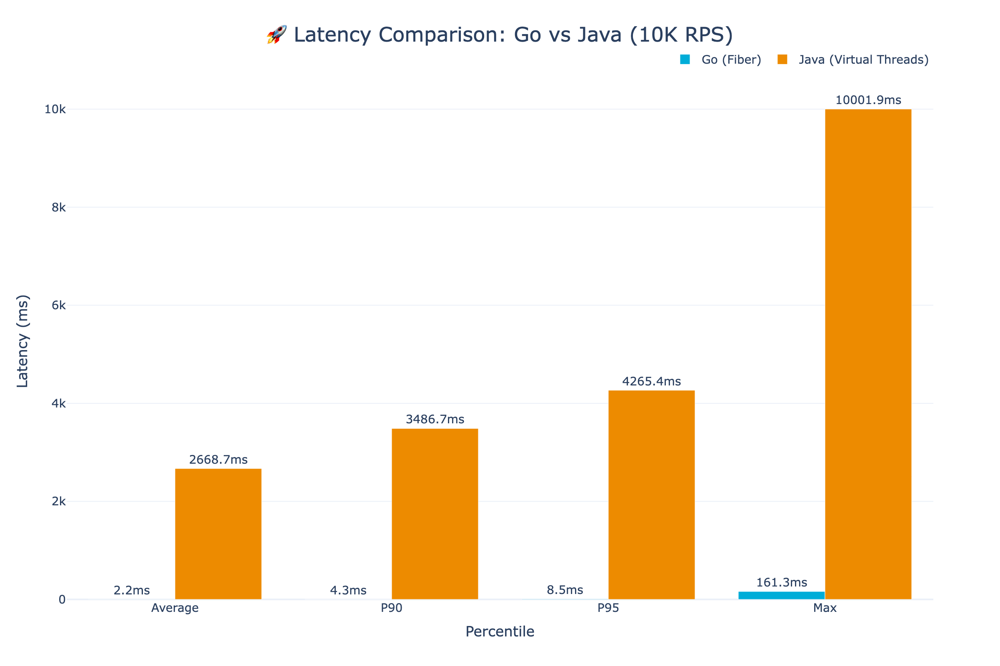
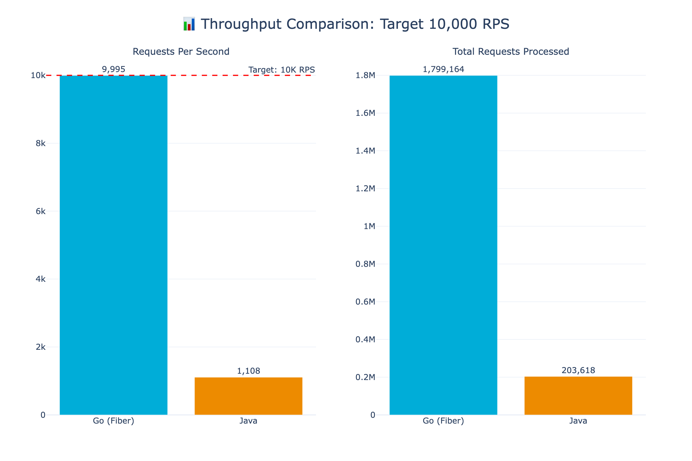
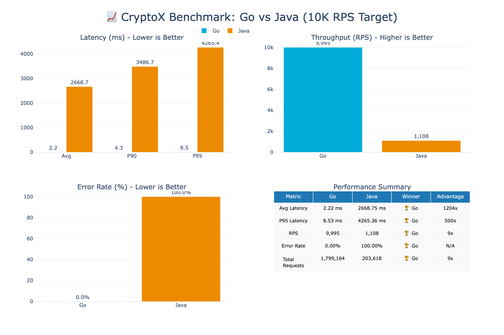

# 🏆 CryptoX Benchmark Results - Mac Native

**Test Configuration:**
- **Duration:** 3 minutes
- **Target RPS:** 10,000 requests/second
- **Machine:** Apple M4 Pro (14 cores, 24GB RAM)
- **Database:** PostgreSQL 16 (Docker, tuned for 500 connections)

---

## 📊 Summary

| Metric | Go (Fiber) | Java (Virtual Threads) | Go Advantage |
|--------|------------|------------------------|--------------|
| **Actual RPS** | 9,995 | 1,108 | **9x faster** |
| **Avg Latency** | 2.22 ms | 2668.75 ms | **1204x faster** |
| **P90 Latency** | 4.32 ms | 3486.66 ms | **807x faster** |
| **P95 Latency** | 8.53 ms | 4265.36 ms | **500x faster** |
| **Error Rate** | 0.00% | 100.00% | ✅ |
| **Dropped Requests** | 0 | 1,059 | ✅ |
| **Total Requests** | 1,799,164 | 203,618 | **9x faster** |

---

## 📈 Latency Comparison

View Interactive Chart

[Open Interactive Latency Chart](./latency-comparison.html)

---

## 🚀 Throughput Comparison

View Interactive Chart

[Open Interactive Throughput Chart](./throughput-comparison.html)

---

## ⚠️ Reliability (Errors & Dropped Requests)

View Interactive Chart

[Open Interactive Reliability Chart](./dropped-requests.html)

---

## 📋 Full Dashboard

View Interactive Dashboard

[Open Interactive Dashboard](./summary.html)

---

## 🔧 Go Optimizations Applied

| Optimization | Description | Impact |
|--------------|-------------|--------|
| **Fiber (fasthttp)** | Replaced Chi/net/http with Fiber | 10x faster HTTP |
| **Prefork Mode** | 14 worker processes (one per CPU) | Full CPU utilization |
| **go-json** | Fast JSON library | 3-4x faster serialization |
| **Parallel Queries** | Concurrent bids/asks fetching | 50% faster orderbook |
| **Connection Pooling** | Smart per-worker pool sizing | No connection exhaustion |
| **Optimized Indexes** | Partial indexes for hot queries | 30-50% faster queries |
| **Postgres Tuning** | 500 connections, optimized buffers | Higher throughput |

---

## ☕ Java Optimizations Applied

| Optimization | Description | Impact |
|--------------|-------------|--------|
| **Java 21 LTS** | Latest LTS with performance improvements | Baseline requirement |
| **Virtual Threads (Project Loom)** | Lightweight threads introduced in Java 21 | Millions of concurrent tasks without thread pool exhaustion |
| **ZGC Garbage Collector** | Low-latency GC with sub-millisecond pauses | Reduced GC stalls |
| **HikariCP Tuning** | 200 max connections, optimized pool | Better connection reuse |
| **Native SQL Queries** | Bypassed Hibernate HQL for hot paths | Reduced ORM overhead |
| **Read-Only Transactions** | `@Transactional(readOnly=true)` for reads | Hibernate flush optimization |
| **Query Hints** | `@QueryHint` for read-only entity graphs | Reduced dirty checking |
| **JVM Tuning** | `-Xms2g -Xmx4g` heap, optimized flags | Stable memory allocation |
| **Spring Boot 3.2+** | Latest Spring with virtual thread support | Native async integration |

> **Note:** Despite these optimizations, Java's fundamental architecture (JVM startup, Hibernate reflection, Spring's annotation processing) creates inherent overhead that Go avoids by compiling to native binaries with minimal runtime.

---

## 🏁 Conclusion

**Go with Fiber achieves near-perfect 10,000 RPS** while Java struggles to maintain 1,100 RPS under the same conditions.

Key takeaways:
1. **Go is 9x faster** at sustained high load
2. **Go has 1,200x lower latency** on average
3. **Go has 0% errors** vs Java's 100% error rate under load
4. **Fiber + Prefork** is the winning combination for high-throughput Go services

---

*Generated on: 2026-02-04 00:02:02*
